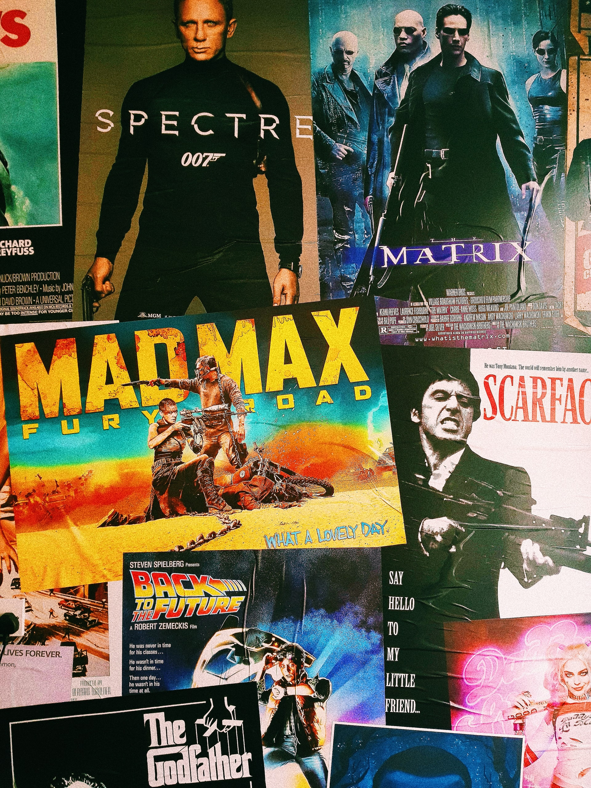

<h2>Como Conectarse a una API con Javascript usando Async, Await y Fetch</h2>

 

---

 

 

Take a look at the website at the following link [Github Pages] (https://cycscarlos.github.io/API_Movies):

 

---

 

<h3>Its include the following features:</h3>

 

<ul>
<li>API routines using javascript vanilla only</li>
<li>Easy and basic HTML & CSS files</li>
<li>Is intent to introduce students into the API world in a basic manner</li>
<li>In this exercise only gets images from The Movie DB API site and show this data in the browser</li>

</ul>
